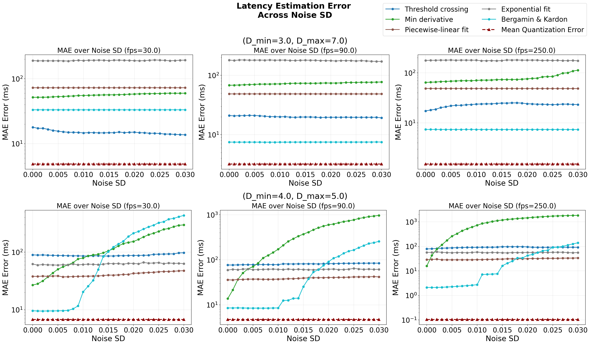

PLR Latency Benchmark
=====================

Code repository for the Paper "Model-based comparison of latency estimation methods for the pupillary light reflex". 
This code enables the evaluation and comparison of various latency detection methods for the pupillary light reflex using synthetic data with controlled conditions.

Features
--------

- Synthetic Data Generation
- Visualization
- Latency Estimation Algorithm Evaluation

Installation
------------

Install dependencies (recommended in a virtualenv):

```bash
python3 -m pip install -r requirements.txt
```

Usage
-----

### Data generation
Generate synthetic data:

```bash
python3 -m data_generation.generate_dataset
```
This will generate a synthetic dataset with the default parameters. Default parameters can be changed in [stat_values.py](data_generation/stat_values.py)

Possible options the data generation:
```bash
options:
  -h, --help            show this help message and exit
  -n NUM_SAMPLES, --num-samples NUM_SAMPLES
                        Number of synthetic recordings to generate (default: 100)
  -o OUTPUT_DIR, --output-dir OUTPUT_DIR
                        Output directory for npz files (default: data)
  -d DURATION, --duration DURATION
                        Duration of each recording in milliseconds (default: 5000)
  -f FPS, --fps FPS     Sampling rate in fps (default: 30.0)
  -s STIM_TIME, --stim-time STIM_TIME
                        Time when stimulus turns on in milliseconds (default: 500)
  -l LED_DURATION, --led-duration LED_DURATION
                        Duration of LED pulse in milliseconds (default: 200)
  --noise NOISE         Standard deviation of gaussian noise (default: 0.03)
```
For further information about how the simulation model works and data is generated, please refer to:
[data_generation/Generator.md](data_generation/Generator.md)

### Data Visualization
A desktop visualizer lets you explore individual recordings and
compare latency estimation methods interactively: load a folder of
.npz files, view observed vs clean pupil traces with frame sample
markers, inspect stimulus timing, and run the available estimation
algorithms. For detailed usage, features and batch-evaluation options,
see the visualizer documentation: [visualizer documentation](docs/visualizer.md).

```bash
python3 visualizer.py 
```

### Benchmark Latency Detection Algorithms

During benchmarking, evaluation can be performed either using a given range with a step size of the sample rate or the noise. The specified range is displayed on the x-axis in the results. In addition, one or more fixed values can be specified for the variable that is not displayed on the x-axis. A new plot is created for each specified fixed value.

Methods to be benchmarked can be selected using the “Methods” option. As default the follwing methods will be evaluated:
- Threshold crossing
- Min derivative
- Piecewise-linear fit
- Exponential fit
- Bergamin & Kardon

To evaluate all methods on a range of sample rates from 25 to 250 with a step size of 5 and fixed values of 0.01, 0.02, and 0.03 for the standard deviation of the noise, the following command can be used:
```bash
python3 evaluate_methods.py --num-samples 1000 --fps-range 25 250 5 --noise 0.01 0.02 0.03 -o results/noise.eps
```

If a range for the standard deviation of the noise at fixed values for the sampling rate is to be benchmarked, the following command could be used
```bash
python3 evaluate_methods.py --num-samples 1000 --fps 30 90 250 --noise-range 0.00 0.03 0.001 -o results/noise.eps
```

**Save/Load evaluation results** — To avoid re-running expensive benchmarks you can save the evaluation results to a file and reload them later for plotting and analysis:
   - Save results at the end of the benchmark: 
   ```bash
   python3 evaluate_methods.py --fps-range 25 200 25 --noise 0.03 --save-results results
   ```
   - Load previously saved reesults and generate plot:
   ```bash
   python3 evaluate_methods.py --load-results results --output myplot.png
   ```

An example plot of the results of a benchmark over a range of standard deviations of noise with three different sampling rates is shown in the following figure:



Adding New Methods
------------------

To add a new latency estimation method:

1. Add a static method to `LatencyMethods` class in `latency_methods.py`:
   ```python
   @staticmethod
   def my_new_method(t, signal, stim_time):
       # Your implementation here
       return latency_time, {"type": "your_identifier_for_plotting", "data": your_data}
   ```

2. Add method name to `get_available_methods()` list in `latency_methods.py`

3. Add dispatcher case in `compute_by_name()` method

4. Update `_plot_method_specific()` in `plot_widget.py` to handle the new visualization

Dependencies
------------

- **PySide6** — Qt6 bindings for GUI
- **matplotlib** — Plotting library
- **numpy** — Numerical computations

Notes
-----

- The app is designed for exploration and testing of latency estimation methods
- Synthetic data allows ground truth comparison and controlled parameter variation
- Frame scatter dots help visualize sampling limitations and quantization error
- CSV export enables statistical analysis and method comparison across datasets
- Modular design makes it easy to add new estimation methods or visualization features


License
--------

This Code is published under the GNU GENERAL PUBLIC LICENSE.

Contributing
--------

Contributions are welcome! Please feel free to submit pull requests or open issues for bugs and feature requests.

Authors
--------

Marcel Schepelmann